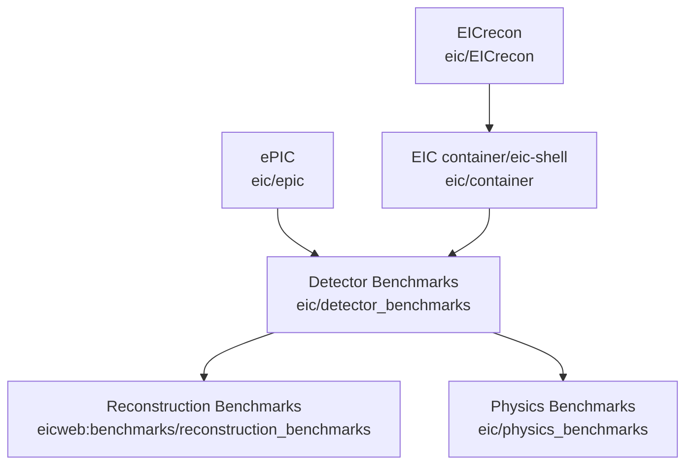

Physics Benchmarks for the EIC
==============================

[](https://github.com/eic/physics_benchmarks/actions/workflows/mirror.yaml)


## Documentation Links

- [`EDM4eic`](https://github.com/eic/EDM4eic) - EIC data model. (See [`ReconstructedParticle`](https://eic.github.io/EDM4eic/classedm4eic_1_1_reconstructed_particle.html) for most needs)
- [`EICrecon`](https://github.com/eic/EICrecon) reconstruction framework.
- Benchmark repository common code - [common_bench](https://eicweb.phy.anl.gov/EIC/benchmarks/common_bench)
- ROOT's [`RDataFrame`](https://root.cern/doc/master/classROOT_1_1RDataFrame.html)

## Adding new benchmarks

See the [`benchmarks/diffractive_vm`](https://github.com/eic/physics_benchmarks/tree/master/benchmarks/diffractive_vm)
directory for a basic example. Note currently the reconstruction is far from perfect.

### Pass/Fail tests

- Create a script that returns exit status 0 for success.
- Any non-zero value will be considered failure.

See [common_bench](https://eicweb.phy.anl.gov/EIC/benchmarks/common_bench) for details.

## Running Locally

### Local development example

Here we setup to use our local build of the `juggler` library.

```
git clone https://eicweb.phy.anl.gov/EIC/benchmarks/physics_benchmarks.git && cd physics_benchmarks
git clone https://eicweb.phy.anl.gov/EIC/benchmarks/common_bench.git setup
source setup/bin/env.sh && ./setup/bin/install_common.sh
source .local/bin/env.sh && build_detector.sh
mkdir_local_data_link sim_output
mkdir -p results config

```

## Repositories and Workflow

### Repositories

The collaboration uses [the EIC group on eicweb](https://eicweb.phy.anl.gov/EIC) which contains the subgroups
[detectors](https://eicweb.phy.anl.gov/EIC/detectors) and
[benchmarks](https://eicweb.phy.anl.gov/EIC/benchmarks). 

The main software components locally developed are:
- [`EICrecon`](https://github.com/eic/EICrecon) ([documentation](https://eicrecon.epic-eic.org/#/)) - Event processing framework (i.e. algorithms live)
- [`EDM4eic`](https://github.com/eic/EDM4eic) - EIC data model
- [`npsim`](https://github.com/eic/npsim) - DD4hep simulation steering

The key collaboration/user code repositories are:
- [epic](https://github.com/eic/epic/) - ePIC at IP6
- [D2EIC](https://github.com/eic/D2EIC) - Detector II at IP8
- [Detector benchmarks](https://github.com/eic/detector_benchmarks) ([eicweb mirror](https://eicweb.phy.anl.gov/EIC/benchmarks/detector_benchmarks)) - Set of analysis scripts  run on the Geant4 output before any digitization or reconstruction. Also contains some detector calibrations.
- [Physics benchmarks](https://github.com/eic/physics_benchmarks) ([eicweb mirror](https://eicweb.phy.anl.gov/EIC/benchmarks/physics_benchmarks)) - Analysis of reconstructed for physics performance.  The goal is to provide metrics for optimizing detector design and reconstruction.
- [Reconstruction benchmarks](https://eicweb.phy.anl.gov/EIC/benchmarks/reconstruction_benchmarks) (legacy only)

### Pipelines and Artifacts

The SWG leverages gitlab's CI/CD features heavily in our workflow.
Here are some simplified explanations of these.

#### Pipeline 

A pipeline is an automated set of jobs/scripts that are triggered by certain actions, such as pushing a merge request or merging into the master/main branch of a repository.
Typically there is one pipeline per repository but there can multiple and a pipline can trigger downstream pipelines ("child" pipelines) or it can be triggered by an upstream pipeline. They can also be triggered manually.

The graph below show some of the downstream pipeline triggers (arrows) between different repositories.


Note that on any change to the detectors will cause all the benchmarks to be run.

"OK, pipelines run automatically. What is the big deal?"

#### Artifacts

All pipeline jobs have "artifacts" which are just selected files that are saved and can be downloaded individually or as a zip file.

Note artifacts are not the output data which is far too big. Artifacts are small files such as images, plots, text files, reports, etc.

Artifacts can be browsed via the web interface, for example, the latest in reconstruction benchmark results in the 
[summary job can be browsed](https://eicweb.phy.anl.gov/EIC/benchmarks/physics_benchmarks/-/jobs/artifacts/master/browse/results?job=summary).
